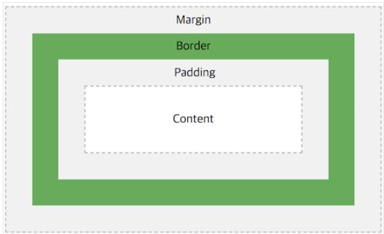

# CSS 속성
### BoxModel 구성

- Content 영역 : 요소의 실제 내용을 포함하는 영역
- Border : Content 영역을 감싸는 테두리 선
- Padding : Content 영역과 테두리 사이의 여백
  - Content 영역이 배경, 색 또는 이미지가 있을 때 패딩 영역까지 영향을 미침
  - 이에 따라 Padding 이 Content 의 연장이라고 볼 수 도 있음.
- Margin : Border 바깥쪽의 영역
  - 주변 요소와의 여백을 지정하기 위해 이용한다.
***
- Border : 요소의 테두리
  - border-width: ```border-width: [top] [right] [bottom] [left]```
  - border-style: ```border-style: [top] [right] [bottom] [left]```
  - border-color:```border-color: [top] [right] [bottom] [left]```
  - 축약형 : ```border: [-width] [-style] [-color]```
- Padding : 요소의 안쪽 여백
  - length : 고정값으로 지정한다.
  - percent : 요소의 width에 상대적인 크기를 지정한다.
  - padding -top/right/bottom/left : content 영역의 4가지 방향 여백을 지정한다.
  - 축약형 : ```padding: [-top] [-right] [-bottom] [-left]```
- Margin : 요소의 바깥 여백
  - width 가 지정되어 있어야 margin을 지정할 수 있다.
  - margin -top/right/bottom/left : 바깥 영역의 4가지 방향 여백을 지정한다.
  - margin auto : 자동으로 브라우저에 의해 계산된 값이 적용된다.
  - margin collapse : 인접한 두 개 이상의 수직 방향 박스의 마진이 하나로 합쳐지는 경우
    - 두 요소가 상하로 인접한 경우 : 위 요소의 하단 마진과 아래 요소의 상단 마진의 병합이 일어남.
    - 부모 요소와 첫 번째 자식 요소 또는 마지막 자식 요소
      - 부모 요소의 상단 마진과 첫 번째 자식 요소의 상단 마진 병합이 일어난다.
      - 부모 요소의 하단 마진과 마지막 자식 요소의 하단 마진 병합이 일어난다.
    - 내용이 없는 빈 요소의 경우 : 해당 요소의 상단 마진과 하단 마진의 병합이 일어난다.
***
- Margin 과 Padding 의 비교<br>

|   | +  | - | auto    | 단위  |
|:----| :--:| :--: | :--:|:----: |
| Margin    | O| O | O |px,%...|
| Padding   | O| X | X |px,%...|

💡 percent(%) 는 가로축을 기준으로 움직인다
***
- Width : Content 요소의 가로값을 결정 ```width:auto|value|initial|inherit|;```
    - auto : 브라우저에 의해 자동으로 계산(Default 값)
    - length : 고정값으로 지정( Ex. px, em...)
    - percent : 부모 요소의 width에 상대적인 크기를 지정
    - 💡 Box의 크기는 width와 Padding, Border를 전부 더한 값이다.