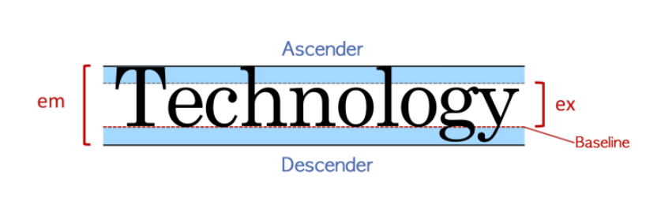

# CSS 속성
### 폰트
- 타이포그래피 구조

    
    - em : 폰트의 전체 높이를 의미한다.
    - ex : 해당 폰트의 영문 소문자 x의 높이를 의미한다.
    - Baseline : 소문자 x를 기준으로 하단의 라인을 의미한다.
    - Descender : 소문자에서 baseline 아래로 쳐지는 영역을 의미한다. (서체에 따라 길이 다름)
    - Ascender : 소문자 x의 상단 라인 위로 넘어가는 영역
- Font-Family : ```font-family:family-name|generic-family|initial|inherit;```
  - family-name 과 generic-family로 구성
    - family-name :  사용할 폰트의 이름을 나타내며 ' , ' 로 구분하여 여러 개 선언 할 수 있다. 먼저 선언된 순서대로 우선순위가 결정되며,  이름 중간에 공백이 있거나, 한글일 경우 홑따옴표로 묶어서 선언한다.
    - generic-family : family-name으로 지정된 글꼴을 사용할 수 없을 경우를 대비해, 브라우저가 대체할 수 있는 폰트가 필요한 경우 선택할 수 있게 해준다. font-family 속성의 맨 마지막에 선언해야 하며, 키워드이기 때문에 따옴표 등의 인용부호로 묶지 않는 것이 원칙이다.
  - family-name 은 지정 순서로 폰트의 우선순위 결정(한글 지원 여부)
  - generic-family는 family-name으로 지정한 폰트가 사용자의 컴퓨터에 없을 시 적절한 폰트를 선택할 수 있도록 함.
- Line-Height : ```line-height:normal|number|length|initial|inherit;```
  - line-height 는 font-size를 포함한 간격인 것을 기억해두자.
  - 브라우저마다 기준이 달라서 행간을 각각 확인해야 한다.
  - normal : 기본값으로 브라우저의 기본 속성을 따른다.
  - number : font-size를 기준으로 설정한 숫자만큼 배율로 적용한다.
  - length : px, em 등 고정 수치로 할당한다.
  - % : font-size를 기준으로 설정한 퍼센트 만큼 배율로 적용한다.
  - "number" vs "%" : 상속 시에 ```number```는 숫자값이 그대로 상속되지만, ```%```는 이미 계산된 px 값이 상속된다. 
- Font-Size : ```font-sizekeyword | length | initial | inherit;```
  - absolute size : 기본값인 medium에 대한 상대적인 크기로 브라우저마다 사이즈가 다르다.
  - relative size : 부모 요소의 font-size 크기에 대한 상대적 크기이다.
  - length: px, em, rem 등의 단위를 이용하여 고정된 크기를 지정할 수 있다.
    - em : 부모요소의 font-size에 em 값을 곱한 크기
    - rem : 루트의 font-size에 rem 값을 곱한 크기
  - percent : 부모 요소의 font-size를 기준으로 백분율 계산된 값을 지정할 수 있다.
  - viewport units : vw,vh 단위로 뷰포트를 기준으로 하여 유동적인 font-size를 지정할 수 있다. vw는 width의 1% vh는 height의 1%다.
- Font-Weight : ```font-weight: normal | bold | bolder | lighter | number | initial | inherit ;```
  - normal : 기본 값(400)
  - bold : 굵게 표현(700)
  - bolder : 부모 요소보다 두껍게 표현
  - lighter : 부모 요소보다 얇게 표현
  - number : 100 ~ 900(클수록 더 두꺼움)
- Font-Style : ```font-style : normal| italic| oblique| initial| inherit;|```
  - normal : font-family 내 분류된 기본값
  - italic : italic 스타일
  - oblique : oblique 스타일
- Font-Variant : ```font-variant: normal | small-caps | initial | inherit ;```
  - small-caps : 소문자를 작은 대문자로 변경
- Font 축약형 : ```font: font-style font-variant font-weight font-size/line-height font-family | initial | inherit;```
  - font-size와 font-family는 반드시 선언해야하는 필수 속성이다.
  - 속성의 선언 순서를 지켜야하며 빠진 속성은 기본값으로 지정된다.
- 웹 폰트(@FONT-FACE)
  - 웹에 있는 글꼴을 사용자의 로컬환경으로 다운로드하여 적용하는 속성이다.
    ```css
    @font-face {
    font-family: webNanumGothic; /* 사용자 지정 웹 폰트명 */
    src: url(NanumGothic.eot); /* 적용 될 웹 폰트의 경로 */
    font-weight: bold; /* 필요에 따라 지정 */
    font-style: italic; /* 필요에 따라 지정 */
    }
    ```
- Vertical-Align :```vertical-align: keyword | length | percent | initial | inherit ;```
  - 인라인 레벨 요소 또는 테이블 셀 상자의 수직정렬을 지정한다.
  - length : 요소를 지정한 길이만큼 올리거나 내림
  - % : 요소를 line-height 기준으로 올리거나 내림
  - keyword : baseline, sub, super, top, text-top, middle, bottom, text-bottom
- Text-Align : ```text-align: left | right | center | justify | initial | inherit ;```
  - 텍스트의 정렬을 지정하는 속성
  - left / right : 왼쪽 오른쪽으로 정렬
  - center : 가운데정렬
  - justify : 양 끝 정렬
  - text-align 과 display의 관계
    - text-align 은 inline-level에서만 적용(block-level은 X)
    - block 요소를 가운데 정렬하고자 한다면 margin auto 값을 이용
- Text-Indent : ```text-indent: length | initial | inherit;```
  - 텍스트의 들여쓰기를 지정하는 속성이다.(음수도 가능)
    - length : 고정 수치로 허용(px, em)
    - % : 부모요소의 width 를 기준으로 퍼센트 지정
- Text-Decoration : ```text-decoration: text-decoration-line text-decoration-color text-decoration-style | initial | inherit;```
  - 텍스트의 꾸밈의 종류를 지정하는 속성이다.
  - underline/overline/line-through : 밑줄/윗줄/중간줄로 꾸밈 설정
  - color 와 style로 줄의 색깔이나 선의 스타일도 지정할 수 있음.
***
- 기타 속성들
  - white-space : ```white-space: normal | nowrap | pre | pre-line | pre-wrap | initial | inherit;```
    - 요소 안에 공백을 어떻게 처리할 지 지정하는 속성이다.
    - normal : 공백과 개행을 무시하고, 필요한 경우 자동 줄바꿈 발생
    - nowrap : 공백과 개행을 무시하나 자동줄바꿈이 일어나지 않음.
    - pre : 공백과 개행을 표현하고 자동 줄바꿈이 일어나지 않음.
    - pre-line : 공백은 무시하고 개행만 표현. 필요시 자동 줄바꿈 발생.
    - pre-wrap : 개행은 무시하고 공백만 표현. 필요시 자동 줄바꿈 발생.
  - letter-spacing : ```letter-spacing: normal | length | initial | inherit;```
    - 자간을 지정하는 속성이다.(length로 지정)
  - word-break : ```word-break: normal | break-all | keep-all | initial | inherit;```
    - 단어가 라인 끝에 나올경우 어떻게 처리할지 지정하는 속성이다.
    - break-all : 중단점은 음절, 모든글자가 요소를 벗어나지 않고 개행
    - keep-all : 공백이나 하이픈을 중단점으로 함
  - word-wrap : ```word-wrap: normal|break-word|initial|inherit;```
    - break-word : 모든 글자가 요소를 벗어나지 않고 강제로 개행